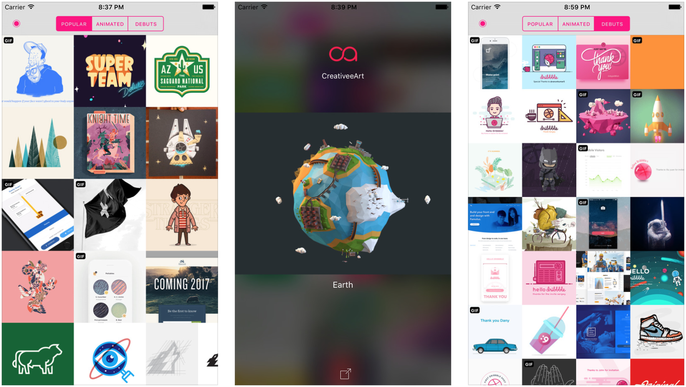

# Hoopy for iOS
Hoopy is an open-source, lightweight and minimal Dribbble client, 
which showcases the work of the most talented designers, illustrators and creatives in the design community.

## Getting Started

To get started and run the app, you need to follow these simple steps:

1. Open the Hoopy workspace in Xcode.
2. Sign up for a Dribbble account.
3. Register a new Dribbble application (a new `Client Access Token` will be generated for the application).
4. Assign the `Client Access Token` to `DribbbleDataSource.dribbbleAccessToken`.
5. Run Hoopy on your iOS device or Simulator.
6. All set!

## Compatibility

* This project is written in Swift 3.0 and requires Xcode 8 to build and run.
* Hoopy runs on iOS 10+.

## Hoopy on the App Store

## Contributors

* [Daniel Inoa](https://twitter.com/danielinoa_)

## Contributing to Hoopy

Contributions to Hoopy are more than welcomed! Feel free to fork and open a pull request. 
Please make your changes in a specific branch and request to pull into `master`.

## License

Hoopy is under the MIT License.
Any credit would be appreciated in case you release a derivative of Hoopy.
